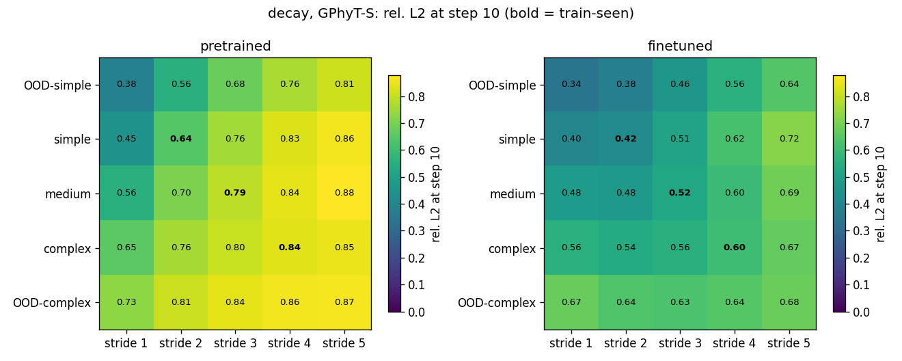
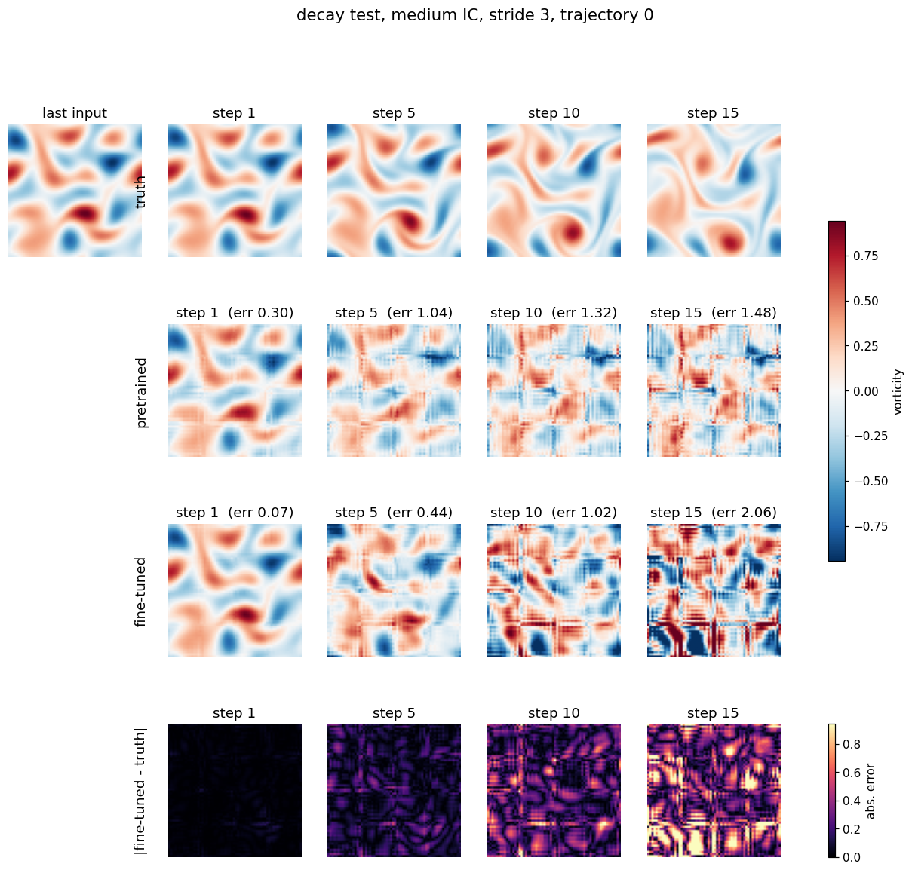
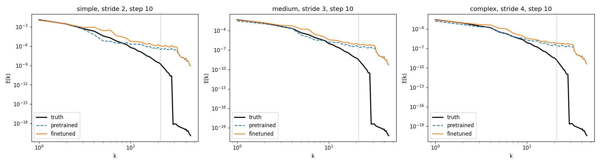
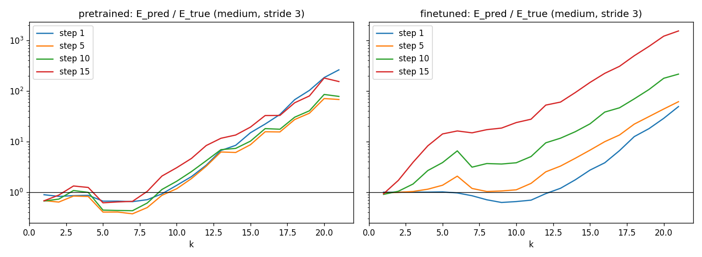
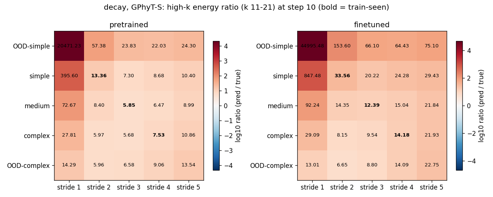

# DRAI – GPhyT Spectral Analysis

Spectral evaluation of the **General Physics Transformer (GPhyT)**
([paper](https://arxiv.org/abs/2509.13805) · [code](https://github.com/FloWsnr/General-Physics-Transformer) ·
[weights](https://huggingface.co/flwi/Physics-Foundation-Model)) on PDE datasets generated with
[Exponax](https://github.com/Ceyron/exponax), following Appendix A of
*"Do Physics Foundation Models Learn Generalizable Physics?"* (arXiv:2605.29283).

Part of the DRAI course project *Spectral Analysis on Foundation Models for PDEs*.

**Question:** does GPhyT reproduce the energy spectrum of the reference solutions, especially at high
wavenumbers, and how does this depend on initial-condition complexity, time stride and rollout horizon?

## Contents

- [Repository structure](#repository-structure)
- [Setup](#setup)
- [Usage](#usage)
- [Method](#method)
- [Results: Decay](#results-decay-gphyt-s)
- [Limitations and next steps](#limitations-and-next-steps)

## Repository structure

```
├── gphyt_eval/                 code
│   ├── common.py               data loading, GPhyT input format, model loading, rollout, metrics
│   ├── finetune.py             fine-tune pretrained GPhyT on the train split
│   ├── evaluate.py             5x5 test grid: rel. L2 error + energy spectra + figures
│   └── plot_examples.py        predicted vs true fields for one test trajectory
├── figures/<dataset>_gphyt-S/  figures (png)
├── results/<dataset>_gphyt-S/  tables: summary.csv (test results), log.csv (training log)
├── runs/                       checkpoints and raw results (local only, not on GitHub)
└── requirements.txt
```

Data files (`*.npz`, 2–4.5 GB each) and model checkpoints (`*.pt`) are not in the repository.

## Setup

```bash
pip install -r requirements.txt
git clone https://github.com/FloWsnr/General-Physics-Transformer
```

Then edit the paths at the top of `gphyt_eval/common.py`:
- `GPHYT_ROOT`: the cloned General-Physics-Transformer folder
- `DATA_DIR`: the folder with the dataset files (`decay.npz`, `burgers.npz`, ...)

The pretrained weights are downloaded automatically from Hugging Face. A GPU is recommended
(fine-tuning on Decay took ~12 min on an RTX 5060 Laptop GPU).

## Usage

```bash
cd gphyt_eval
python finetune.py --dataset decay                                  # fine-tune GPhyT-S
python evaluate.py --dataset decay                                  # full test grid
python plot_examples.py --dataset decay --family medium --stride 3  # field images
```

Datasets supported: `decay`, `kolmogorov` (stored as vorticity, converted to velocity) and `burgers` (velocity).

## Method

**Data.** 2D periodic fields, 64×64 grid, 100 frames per trajectory. Five initial-condition (IC) families of
increasing complexity: OOD-simple, simple, medium, complex, OOD-complex. 200 train trajectories for
simple/medium/complex; 100 validation and 100 test trajectories for all five.

**GPhyT input.** GPhyT takes 4 frames of 5 fields (pressure, density, temperature, velocity x, velocity y)
on a fixed 256×128 grid.
- Decay stores vorticity, which is converted to velocity with an FFT (Δψ = ω, u = ∇⊥ψ).
- The periodic 64×64 field is **tiled 4×2** to 256×128 (no interpolation, so the spectrum is unchanged).
- Pressure, density and temperature are set to zero.
- Per-sample z-score normalisation.

**Fine-tuning.** GPhyT-S (smallest model), trained only on the train-seen cells of the paper
(simple/stride 2, medium/stride 3, complex/stride 4). 1-step MSE on velocity, AdamW (lr 5e-5),
5000 steps, best checkpoint by validation error.

**Evaluation (paper protocol).** 20-frame clips with frame stride 1–5. The model gets 4 context frames and
predicts 10 in-horizon + 5 OOD rollout steps autoregressively. All 5 IC families × 5 strides = 25 test cells,
100 trajectories each. Baseline: copy the last input frame.

**Spectrum.** Radial kinetic-energy spectrum E(k). High-k band = 11 ≤ k ≤ 21
(the solver's 2/3 dealiasing keeps |k| ≤ 21).

## Results: Decay (GPhyT-S)

### Prediction error

Relative L2 error of velocity at rollout step 10, averaged by test-cell type
(full table: [results/decay_gphyt-S/summary.csv](results/decay_gphyt-S/summary.csv)):

| Test cells | Copy last frame | Pretrained | Fine-tuned |
|---|---|---|---|
| train-seen | 0.76 | 0.76 | **0.52** |
| in-range shift | 0.77 | 0.78 | **0.55** |
| IC-OOD | 0.67 | 0.75 | **0.55** |
| dynamic-OOD | 0.66 | 0.71 | **0.59** |
| joint-OOD | 0.58 | 0.70 | 0.58 |

Zero-shot, GPhyT is no better than copying the last frame. Fine-tuning reduces the error by about 30%,
also on test cells not seen during training.



### Predicted fields

Truth, pretrained, fine-tuned and absolute error (vorticity), medium IC, stride 3.
The fine-tuned model is accurate at step 1 (error 0.07), but **16×16 block artifacts** from GPhyT's patch
tokenizer appear after ~5 steps and dominate by step 10.



More: [complex IC, stride 4](figures/decay_gphyt-S/examples_complex_stride4_traj0.png).

### Energy spectrum

At step 10, large scales (k ≤ 4) are reproduced well, but both models put **too much** energy at high
wavenumbers (k > 10). This is the opposite of spectral smoothing (losing high frequencies).



The excess grows with every rollout step. Fine-tuning makes step 1 almost exact but the high-k excess
builds up faster afterwards: **lower L2 error does not mean a better spectrum.**



High-k energy ratio (predicted / true, log scale) on the full test grid:



## Limitations and next steps

Limitations:
- One model size (S), one dataset (Decay), one training run.
- The high-k ratio is unstable for OOD-simple (the true field has almost no high-k energy).
- The effect of tiling and of the zero-filled channels has not been tested.

Next steps:
- Run the same pipeline on **Burgers** (sharp fronts) and **Kolmogorov** (turbulence) to see whether the
  high-k excess comes from the model or from the physics.
- Relate the high-k error to the L2 error, IC complexity and rollout horizon.
